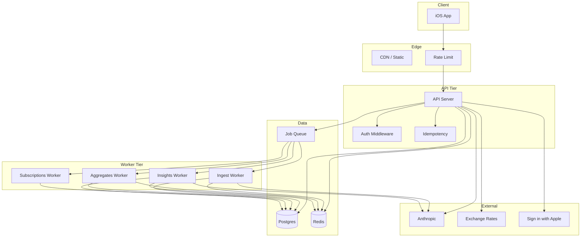

# Airy — Architecture Redesign (Startup-Grade)

**Product vision (unchanged):** AI-first personal finance tracker; screenshot + manual entry; automatic extraction, categorization, subscription detection, duplicate detection, merchant memory, and AI insights. Premium, minimal, intelligent experience.

**Design goal:** Keep the vision; harden security, scale, reliability, and UX so the system is built like a top Silicon Valley startup from day one.

---

## 1. Design Principles

| Principle | Meaning |
|-----------|--------|
| **Security by default** | No optional auth paths in production; verify identity at signup; rate limit and cap all inputs. |
| **Fast by design** | Sync path &lt; 500 ms for typical screenshot; batch DB/Redis; aggregate-first reads; async for heavy work. |
| **Observable** | Every request and job have trace ids; metrics for latency, errors, and business events; SLOs and alerting. |
| **Cost-conscious** | Deterministic first; AI only when needed; cache aggressively; cap and meter AI usage. |
| **Event-driven where it helps** | Persist transactions → emit event → workers refresh aggregates, detect subscriptions, invalidate caches. |
| **Schema-first** | All APIs and AI outputs have a single source of truth (Zod/OpenAPI); validate at the edge. |

---

## 2. High-Level System Design

- **API tier:** Stateless; auth, validation, idempotency, rate limit; sync ingestion for 1–2 items; enqueue for 3+ or for post-processing.
- **Worker tier:** Separate processes; scale independently; consume from one queue (or queues per job type).
- **Data:** Postgres (source of truth), Redis (cache, rate limit, idempotency, sessions), queue (BullMQ or SQS-style).

---

## 3. iOS Architecture (Redesigned)

### 3.1 Structure

- **Offline-first:** Local SQLite/SwiftData is source of truth for the device. Sync with backend is a separate layer that pushes/pulls deltas.
- **Sync protocol:** Backend is source of truth for “cloud” data. App sends: new transactions (from screenshot or manual), category/merchant corrections. App receives: transaction list, aggregates, insights. Use cursor or `updatedAt` for incremental sync; conflict resolution: server-wins for ingestion, user-wins for category/merchant overrides (applied server-side via merchant rules).
- **On-device pipeline:** For “add screenshot”: run Vision OCR → if offline, enqueue payload in local queue and show “Will sync when online.” When online: send with idempotency key; on 200, merge result into local store and clear queue item.
- **No x-user-id in production:** All requests use JWT from Sign in with Apple (or equivalent). Refresh token or re-auth when expired.

### 3.2 Key flows

- **Onboarding:** One clear step: “Add a receipt or payment screenshot to get started.” Optional: “Set base currency,” “Enable notifications for monthly summary.”
- **Screenshot:** Camera or library → OCR on device → upload OCR + hash + metadata. Show cloud mascot with progress (“Reading amounts”, “Checking duplicates”, …). Result: “X added, Y duplicates skipped, Z need review” and deep link to pending when Z &gt; 0.
- **Pending review:** Dedicated section (tab or Home banner). Each item shows amount, date, category, merchant with “Date assumed today” / “Merchant unknown” when applicable. Confirm or edit → PATCH + optional merchant-rule API so “We’ll remember [merchant] → [category].”
- **Insights/Dashboard:** Read from local store (synced). On pull-to-refresh or on sync, request dashboard/insights from API; cache in local store. Show skeleton on first load; show “Updated just now” when cache was invalidated after new data.

### 3.3 Friction fixes (by design)

- Empty state: explicit CTA “Add your first transaction.”
- Duplicate: always show “X duplicates skipped” and optional “Already added: [summary].”
- Merchant learning: after edit, show “We’ll remember: [merchant] → [category].”
- First month summary: special copy “Your first month” / “Baseline for next month” when previous month has no data.
- AI limit: show “X of 10 analyses left” and soft cap before 402.

---

## 4. Backend Architecture (Redesigned)

### 4.1 Separation of API and Workers

- **API server:** HTTP only. Handles auth, validation, idempotency, rate limit; runs **sync ingestion only for 1–2 parsed items** (target &lt; 500 ms p95). For 3+ items or when “async preferred” flag is set, return 202 with `jobId` and enqueue.
- **Workers:** Separate deployable(s). Consume jobs: `screenshot.ingest`, `aggregates.refresh`, `subscriptions.detect`, `insights.refresh`. No HTTP in worker process; scale by queue depth.
- **Same repo, multiple entrypoints:** e.g. `node dist/api.js`, `node dist/workers/ingest.js`, `node dist/workers/aggregates.js`, or separate containers.

### 4.2 Request flow (sync ingestion, 1–2 items)

1. **Middleware:** Rate limit (per IP + per user), auth (JWT only in prod), body size limit (e.g. 1 MB), request-id.
2. **Idempotency:** If `Idempotency-Key` present, look up Redis; if hit, return stored response and 200.
3. **Validate:** Zod for body (ocrText, localHash, baseCurrency, locale); reject unknown fields.
4. **Parse:** Normalize OCR → deterministic parse. If 0 items, return structured error (`reason: 'no_transactions_found' | 'ocr_empty'`).
5. **Batch resolution:** One call to fetch “recent transactions” for duplicate check (e.g. 500 or time-bound); one call to fetch merchant rules for all distinct merchants in the batch; one call to get exchange rates for baseCurrency.
6. **Per item (in memory):** Apply merchant rules → category + confidence; run duplicate scoring against the batch; if hash match, short-circuit duplicate. Decide: accept, skip (duplicate), or pending (low confidence).
7. **Persist:** Single `prisma.$transaction`: insert all accepted transactions + pending rows. Then **enqueue** (do not run in request): `aggregates.refresh`, `subscriptions.detect` with userId and yearMonth.
8. **Response:** Return accepted, duplicateSkipped, pendingReview, pendingIds, errors; store in Redis under idempotency key (TTL 24h).
9. **Observability:** Log request-id, userId, duration, parsed count, accepted, duplicateSkipped, pendingReview.

### 4.3 Async ingestion (3+ items or 202)

- API enqueues job `screenshot.ingest` with payload (userId, ocrText, localHash, baseCurrency, idempotencyKey). Returns 202 and `jobId`.
- Worker runs same pipeline (batch resolution, persist, then enqueue aggregates + subscriptions). On success, can publish “job.completed” for client poll or push.
- Client polls `GET /jobs/:jobId` or listens for push; when completed, refetches transaction list or sync.

### 4.4 Auth and identity

- **Sign in with Apple:** Client sends identity token; API verifies with Apple, extracts `sub` (and email if provided). Map `sub` to internal `userId`; create or load user; issue JWT (short-lived access + optional refresh). No `x-user-id` in production.
- **JWT:** Access token in Authorization header; required for all authenticated routes. Refresh before expiry; optional refresh endpoint.
- **CORS:** Allow only app bundle ID / web origin; no wildcard in prod.

### 4.5 API contract (summary)

- **Idempotency:** POST parse-screenshot, POST /transactions accept `Idempotency-Key`; 200 with same body when replayed.
- **Pagination:** GET /transactions, GET /export: `limit` (max 100), `cursor` (opaque) or `offset`; response includes `nextCursor` or `hasMore`.
- **Errors:** 400 (validation, with `details`), 401 (unauthorized), 402 (entitlement), 404 (resource), 409 (conflict, e.g. idempotency key already used with different body), 429 (rate limit, Retry-After), 503 (dependency down).
- **Health:** GET /health → 200; GET /health/ready → 200 if DB and Redis are reachable, else 503.

---

## 5. Data Model and Storage (Redesigned)

### 5.1 Postgres

- **Partitioning:** `Transaction` partitioned by `transactionDate` (e.g. monthly) once table &gt; ~10M rows or from day one. Enables efficient range scans and archival (drop partition).
- **Retention:** Policy: e.g. keep raw transactions 7 years in hot storage; after 2 years move to cold or aggregate-only for old months. Document in runbook.
- **Aggregate-first read path:** Dashboard and insights **read from** `MonthlyAggregate` / `YearlyAggregate` when row exists. Only when “current month” and no aggregate yet (or stale) compute from Transaction and optionally refresh aggregate in a job.
- **Subscription state:** Persist user choice: `Subscription.status` = `confirmed_subscription` | `subscription_candidate` | `dismissed`. Detector **must not** overwrite `dismissed` or `confirmed_subscription`; only set `subscription_candidate` when creating or when current status is already `subscription_candidate`.

### 5.2 Redis

- **Usage:** Cache (dashboard, insights, entitlements, rates), rate limit counters, idempotency store, optional session store.
- **Keys:** Namespaced (`airy:cache:dashboard:{userId}`, `airy:rates:{baseCurrency}:{date}`, `airy:idempotency:{key}`, `airy:rl:ip:{ip}`, `airy:rl:user:{userId}`). All with TTL. Eviction: volatile-lru; maxmemory set.
- **Invalidation:** On transaction create/update/delete (or subscription change), delete `airy:cache:dashboard:{userId}` and `airy:insights:{userId}:*` so next read is fresh or recomputed.

### 5.3 Indexes (additions)

- **Transaction:** Keep (userId, transactionDate), (userId, sourceImageHash). Optional: partial index `(userId, transactionDate) WHERE isDuplicate = false` for analytics if still scanning in some paths.
- **Hash-first duplicate:** When `sourceImageHash` present, query `WHERE userId = ? AND sourceImageHash = ?` first; if found, return duplicate without loading 500 rows.

---

## 6. Pipeline Redesign (Detail)

### 6.1 Screenshot ingestion (batch-oriented)

- **Input:** ocrText, localHash, baseCurrency, locale, idempotencyKey.
- **Steps:**
  1. Normalize OCR; parse → list of items (amount, currency, date, time, merchant, rawLine).
  2. **Hash-first duplicate:** For each item with same localHash, query once by (userId, sourceImageHash). If any match → mark those items duplicate, skip rest of duplicate check for them.
  3. **Batch fetch:** Get “recent transactions” (e.g. 500 or 90-day window) once; get merchant rules for set of normalized merchant names once; get rates for baseCurrency once.
  4. **Per item:** Category from rules or keyword (no extra DB for rule); confidence; duplicate score against batch (or skip if hash duplicate); currency convert. Classify: accept / duplicate / pending.
  5. **Transaction:** Insert all accepted + pending in one `prisma.$transaction`.
  6. **Enqueue:** `aggregates.refresh(userId, yearMonth)`, `subscriptions.detect(userId)`. Do **not** run in request.
- **AI extraction:** Optional step when parse returns 0 or confidence is low: call structured AI extraction (strict schema, Zod); merge with deterministic; then continue. Prefer async (worker) so sync path stays fast.

### 6.2 Aggregates worker

- **Trigger:** After ingest or on schedule (e.g. nightly for “current month”).
- **Job:** For (userId, yearMonth), compute totals and byCategory from Transaction (or from partition); upsert `MonthlyAggregate`. Optionally refresh `YearlyAggregate` for that year.
- **Effect:** Next dashboard/insight read hits aggregate table → &lt; 10 ms.

### 6.3 Subscriptions worker

- **Trigger:** After ingest or on schedule.
- **Job:** Load user’s expense transactions (or since last run); group by merchant; detect recurring; upsert `Subscription` with status `subscription_candidate` **only** when creating new or when current status is `subscription_candidate`. Do **not** overwrite `dismissed` or `confirmed_subscription`.
- **Effect:** User’s “not a subscription” choice is preserved.

### 6.4 Insights and monthly summary

- **Dashboard:** Read from Redis cache (`dashboard:{userId}`); on miss, read from MonthlyAggregate for this month and last; compute delta; cache 5 min; invalidate on new transaction.
- **Monthly summary:** Deterministic sentence + details (category deltas) returned immediately; optional “polish” via AI in background and cache result. Client gets instant shell; AI fills in when ready or on next load.
- **Behavioral insights:** Read from Redis (`insights:{userId}:{month}`). On miss: load dashboard data (from aggregate/cache), build deterministic cards, optionally call AI for 1–3 more; validate with Zod; cache 1h; invalidate on new transaction.
- **Anomaly:** Precompute in aggregates worker (e.g. “category &gt; 2× rolling average”) and store in cache or small table; insight endpoint reads and formats.

---

## 7. Security (Redesigned)

- **Auth:** JWT only in production; no x-user-id. Sign in with Apple (or OAuth) token verified server-side before issuing JWT.
- **Input:** Body limit 1 MB; Zod validation; category/currency whitelist; date sanity (e.g. no future &gt; 1 day).
- **Rate limit:** Per IP (e.g. 100/min), per user (e.g. 30/min for parse-screenshot, 10/min for insights); 429 with Retry-After.
- **Prompt safety:** Sanitize user-derived content (truncate, strip newlines) before sending to AI; structured JSON input; Zod on all AI outputs.
- **Secrets:** JWT_SECRET required in prod, min 32 chars; no secrets in logs or error bodies.

---

## 8. Observability (Redesigned)

- **Request-id:** Every request gets `x-request-id` (or use incoming). Log and propagate to jobs; include in error responses (no PII).
- **Tracing:** OpenTelemetry (or similar): span per request and per job; span for DB, Redis, Anthropic. Export to vendor (e.g. Datadog, Honeycomb).
- **Metrics:** Counters/histograms: request count by route and status, ingestion latency (p50/p95), duplicate rate, pending rate, AI call count and latency, queue depth, job duration. Expose /metrics (Prometheus) or push to vendor.
- **SLOs:** e.g. p95 parse-screenshot &lt; 500 ms (sync), error rate &lt; 0.1%, queue lag &lt; 5 min. Alert on breach and on dependency failure.
- **Logging:** Structured (JSON in prod); request-id and userId on every log line; redact OCR and body; audit log for auth and transaction create/delete/export.

---

## 9. Cost and Performance (By Design)

- **Deterministic first:** Most screenshots never call AI extraction; only 0 parsed or low confidence trigger AI (and preferably in worker).
- **Cache:** Dashboard, insights, rates, entitlements cached in Redis; short TTL and invalidation on write.
- **Batch:** One “recent transactions,” one merchant rules, one rates per request; no N× round-trips per item.
- **Async:** Heavy work (aggregates, subscriptions, AI extraction) in workers so API stays fast and scalable.
- **Read path:** Aggregate tables and Redis; avoid full table scans on Transaction for every dashboard open.
- **Cap:** AI analysis limit for free users; per-user and global caps on AI calls; token/cost logging for tuning.

---

## 10. Implementation Phases

**Phase 1 — Foundation (weeks 1–2)**  
- Split API and workers (separate entrypoints); move refresh + detectSubscriptions to jobs.  
- Add idempotency (Redis), rate limit (Redis), request-id, body limit.  
- Auth: require JWT in prod; verify Sign in with Apple token at register.  
- Health: /health/ready with DB + Redis check.

**Phase 2 — Pipeline (weeks 2–4)**  
- Batch duplicate check (single fetch of recent tx); hash-first duplicate path.  
- Batch merchant rules and single getRates per request.  
- Wrap ingest persist in prisma.$transaction.  
- Read dashboard from MonthlyAggregate when available; cache getDashboardData in Redis; invalidate on write.

**Phase 3 — UX and product (weeks 4–6)**  
- Structured error codes (no_transactions_found, ocr_empty, duplicate_skipped).  
- Pending review API and “assumed date” / “merchant unknown” hints.  
- Merchant rule API called on transaction edit; “We’ll remember” feedback in app.  
- Subscription status: persist dismissed/confirmed; detector does not overwrite.  
- First-month summary copy; insights cache invalidation on new transaction.

**Phase 4 — Scale and polish (weeks 6–8)**  
- Transaction partitioning by month (migration).  
- Export pagination and cap; GET /transactions pagination.  
- OpenTelemetry + metrics + SLO alerts.  
- Optional: AI extraction in worker; refund/income detection; “Add anyway” for duplicate.

---

## 11. Summary: Before vs After

| Area | Before | After (redesign) |
|------|--------|------------------|
| **Auth** | JWT or x-user-id | JWT only; Sign in with Apple verified |
| **API vs workers** | Same process | Separate; workers scale independently |
| **Ingestion** | N× DB/Redis per item; refresh + detect in request | Batch fetch; single transaction; enqueue post-processing |
| **Duplicate** | findMany(500) per item | Hash-first; one fetch per request; batch scoring |
| **Aggregates** | Written but never read | Read path uses Monthly/Yearly; cache dashboard |
| **Subscriptions** | Detector overwrites user choice | Persist dismissed/confirmed; detector respects |
| **Insights** | 2× getMonthly + AI in request | Cache; invalidate on write; optional async AI polish |
| **Rate limit** | None | Per IP and per user |
| **Idempotency** | None | Redis; 24h TTL |
| **Observability** | Logs only | Request-id, tracing, metrics, SLOs |
| **Data** | Single table, no partition | Partition Transaction; retention policy; aggregate-first read |

Product vision is unchanged; architecture is hardened for security, scale, speed, and reliability so the app can ship and grow like a top-tier startup.
